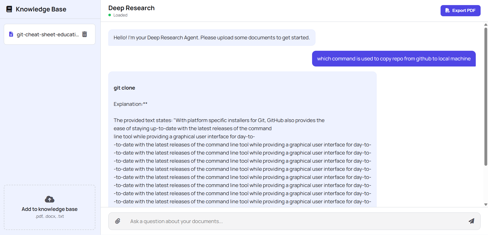

# Deep Research Agent

A sophisticated document-based question answering system powered by Google's Gemma models and advanced retrieval-augmented generation (RAG) techniques.




## 🌟 Features

- **Document Processing**: Support for PDF, DOCX, and TXT files
- **Advanced RAG**: Semantic search using Google's EmbeddingGemma model
- **AI-Powered Answers**: Intelligent response generation with Gemma-3-1B-IT
- **Interactive Chat Interface**: Modern web-based UI with real-time responses
- **Memory Optimization**: Automatic GPU memory management and quantization
- **Export Capabilities**: PDF export of chat conversations
- **Document Management**: Upload, view, and delete documents from knowledge base

## 🏗️ Architecture

```
├── models/
│   ├── embedding_manager.py    # Handles document/query embeddings
│   ├── document_storage.py     # Document storage and retrieval
│   ├── query_processor.py      # Query analysis and decomposition
│   └── answer_generator.py     # AI-powered answer synthesis
├── static/
│   ├── css/style.css          # Application styling
│   └── js/app.js              # Frontend JavaScript
├── templates/
│   └── index.html             # Main application template
├── requirements.txt           # Python dependencies
└── index.py                   # Flask application entry point
```

## 🚀 Quick Start

### Prerequisites

- Python 3.8 or higher
- CUDA-compatible GPU (recommended) or CPU
- 8GB+ RAM (16GB+ recommended for optimal performance)

### Installation

1. **Clone the repository**
   ```bash
   git clone https://github.com/yourusername/deep-research-agent.git
   cd deep-research-agent
   ```

2. **Create virtual environment**
   ```bash
   python -m venv venv
   source venv/bin/activate  # On Windows: venv\Scripts\activate
   ```

3. **Install dependencies**
   ```bash
   pip install -r requirements.txt
   ```

4. **Set up Hugging Face token**
   
   Create a Hugging Face account and get your access token from [here](https://huggingface.co/settings/tokens).
   
   **⚠️ Security Notice**: The current code contains a hardcoded token. For production use, replace it with an environment variable:
   
   ```bash
   export HF_TOKEN="your_hugging_face_token_here"
   ```
   
   Then update the code to use: `os.environ.get('HF_TOKEN')`

5. **Run the application**
   ```bash
   python index.py
   ```

6. **Access the application**
   
   Open your browser and navigate to `http://localhost:5000`

## 📖 Usage

### Document Upload

1. Click the menu button (☰) to open the sidebar
2. Drag and drop files or click the upload area
3. Supported formats: PDF, DOCX, TXT
4. Maximum file size: 16MB

### Asking Questions

1. Wait for the "Ready" status indicator
2. Type your question in the chat input
3. Press Enter or click the send button
4. View the AI-generated response with reasoning steps

### Features

- **Reasoning Steps**: Click "Show Reasoning" to see how the AI processed your query
- **Document Management**: View and delete documents from the knowledge base
- **Export Chat**: Export conversations to PDF format

## ⚙️ Configuration

### Model Configuration

The application uses these models by default:

- **Embedding Model**: `google/embeddinggemma-300M`
- **Generation Model**: `google/gemma-3-1b-it`

To use different models, modify the initialization in `index.py`:

```python
embedding_manager = EmbeddingManager(model_id="your-embedding-model")
answer_generator = AnswerGenerator(model_id="your-generation-model")
```

### Memory Optimization

The system automatically handles memory optimization:

- **GPU < 6GB**: Uses 4-bit quantization
- **GPU ≥ 6GB**: Uses float16 precision
- **CPU Only**: Uses float32 precision

### Storage Configuration

Default storage locations:

- **Documents**: `storage/documents.json`
- **Embeddings**: `storage/embeddings.pkl`
- **Model Cache**: `models_cache/`
- **Uploads**: `static/uploads/`

## 🔧 API Endpoints

| Endpoint | Method | Description |
|----------|--------|-------------|
| `/` | GET | Main application interface |
| `/api/status` | GET | Model loading status |
| `/api/upload` | POST | Upload documents |
| `/api/documents` | GET | List all documents |
| `/api/delete_document` | POST | Delete a document |
| `/api/query` | POST | Process user queries |

### Example API Usage

```bash
# Upload a document
curl -X POST -F "file=@document.pdf" http://localhost:5000/api/upload

# Query the system
curl -X POST -H "Content-Type: application/json" \
     -d '{"query":"What is the main topic?"}' \
     http://localhost:5000/api/query
```

## 🧠 How It Works

### 1. Document Processing
- Text extraction from PDF/DOCX/TXT files
- Content chunking and preprocessing
- Embedding generation using EmbeddingGemma

### 2. Query Processing
- Query classification and decomposition
- Semantic similarity search against document embeddings
- Top-k document retrieval

### 3. Answer Generation
- Context assembly from retrieved documents
- Prompt engineering for Gemma model
- Response generation with reasoning steps
- Fallback to template-based answers

### 4. Memory Management
- Automatic GPU memory cleanup
- Dynamic model quantization
- Efficient embedding storage

## 🛠️ Development

### Development

### Adding New Features

1. **New Document Types**: Extend text extraction in `index.py`
2. **Custom Models**: Modify model initialization in respective manager classes
3. **UI Enhancements**: Update `static/js/app.js` and `static/css/style.css`

## 🚨 Troubleshooting

### Common Issues

**Model Loading Fails**
- Check your internet connection
- Verify Hugging Face token is valid
- Ensure sufficient disk space (models are ~2GB)

**Out of Memory Errors**
- Reduce batch size in embedding generation
- Enable quantization for large models
- Use CPU-only mode if GPU memory is insufficient

**Document Upload Issues**
- Check file size limits (16MB max)
- Verify file format is supported
- Ensure upload directory has write permissions

### Performance Optimization

- **GPU Usage**: Ensure CUDA drivers are properly installed
- **Memory**: Close other GPU-intensive applications
- **Speed**: Use SSD storage for model cache directory